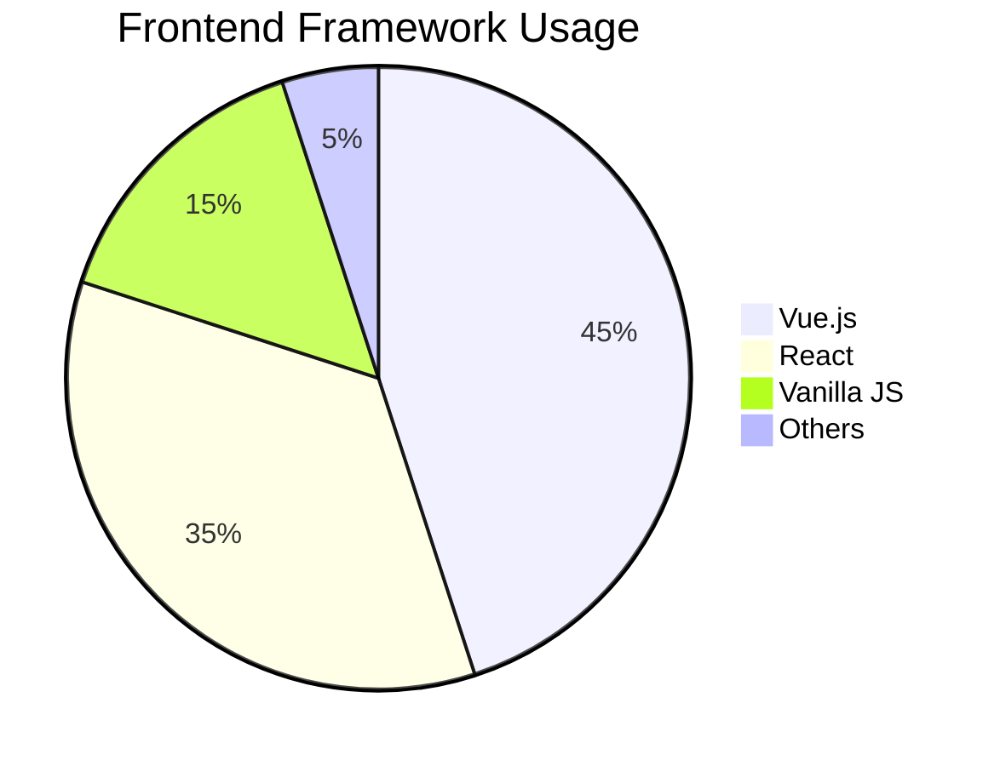

# Hi there! I'm Chanyong Lee 👋


> **7년 경력의 UI/프론트엔드 전문가**  
> 웹 접근성 전문가 · 사용자 중심 UI/UX 구현 · 모던 프론트엔드 기술

## 🚀 About Me

- 🔭 현재 **SGATE 성과관리 솔루션** 프론트엔드 개발 중
- 🌱 **React 생태계** 와 **TypeScript** 심화 학습 중
- 👯 **웹 접근성** 과 **성능 최적화** 에 특화
- 📝 기술 블로그: [CY의 퍼블리싱 업무 일지](https://bit.ly/cyleeBlog)
- 📺 유튜브: [@WebPubLeeShare](https://www.youtube.com/@WebPubLeeShare/videos)

## 📊 GitHub Stats - Frontend Focus

<div align="center">

<!-- Vue 테마 기본 스탯 -->


<!-- Vue/React 중심 언어 통계 -->


<!-- Streak with Vue theme -->


</div>

## 🛠 Tech Stack

### Frontend


### Tools & Environment


## 🏆 Key Achievements

### 📋 웹 접근성 전문성
- **7회 웹 접근성 인증마크** 취득 (인천광역시, 문화포털, IFEZ 등)
- 공공기관 웹사이트 접근성 가이드라인 수립

### 🚀 성능 최적화
- 인천광역시 웹사이트 **로딩 속도 70% 개선** (6초→2초)
- LG유플러스 갤럭시 S25 사전예약 시스템 최적화로 **목표 달성률 135%** 기여

### 👥 팀 리더십
- **4인 프론트엔드 팀** 리드 경험
- 개발 프로세스 개선으로 **팀 생산성 40% 향상**

## 💼 Featured Projects

### 🎯 SGATE 성과관리 솔루션
**Vue3 + Nuxt3 + TypeScript**
- 30+ 커스텀 UI 컴포넌트 시스템 구축
- 서버사이드 렌더링 및 성능 최적화
- [GitHub 링크](https://github.com/box3101/ispark-sgate)

### 📱 LG유플러스 통합 관리 플랫폼
**React + SCSS**
- 이벤트 관리 대시보드 개발
- 페이지 로딩 속도 25% 개선
- 운영팀 업무 효율성 30% 향상

## 📈 Experience Timeline

```
2025.03 ~ 현재    | 이즈파크 - AX Group 프론트엔드 개발자
2024.06 ~ 2025.03 | 프레임아웃 - LG유플러스 파견 개발자  
2024.02 ~ 2024.06 | 포켓컴퍼니 - UI개발팀 과장
2021.01 ~ 2024.02 | 이즈파크 - 공공/금융사업본부 대리
2019.01 ~ 2021.01 | 케이와이엔네트웍스 - 웹1팀 팀장
2018.09 ~ 2018.12 | 이트라이브 - 운영1팀 사원
```

## 🌱 Learning & Sharing

- 📝 **개인 블로그**: 업무 경험과 기술 인사이트 공유
- 📺 **유튜브 채널**: 프론트엔드 학습 내용 정리 및 공유
- 🎓 **팀 내 기술 교육**: JavaScript, React, Vue.js 주간 세션 운영

## 🎨 Framework Preference Visualization

<div align="center">



</div>

## 🔗 Connect with me

[](https://chanyong.netlify.app/)
[](https://bit.ly/cyleeBlog)
[](https://www.youtube.com/@WebPubLeeShare/videos)
[](mailto:box4101@nate.com)

---

<div align="center">

### 💡 "사용자 중심의 웹 서비스로 더 나은 디지털 경험을 만들어갑니다"


</div>


