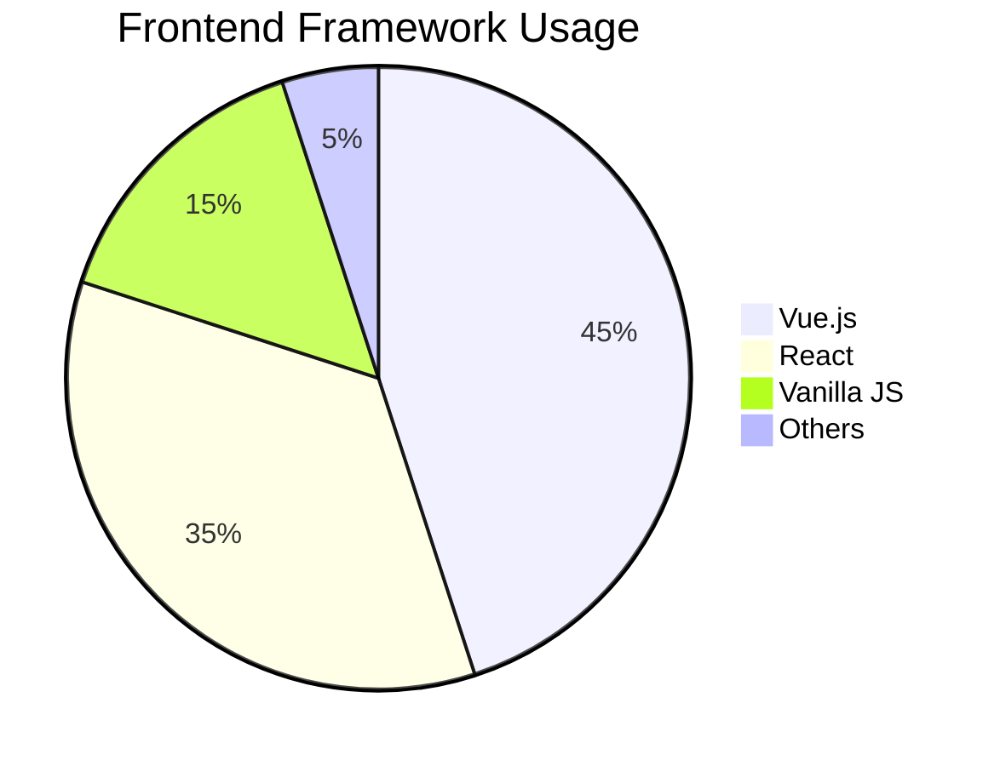

# 🚀 Frontend Specialist - Vue.js & React Expert

## 📊 GitHub Stats - Frontend Focus

<div align="center">

<!-- Vue 테마 기본 스탯 -->


<!-- Vue/React 중심 언어 통계 -->


<!-- Streak with Vue theme -->


</div>

## 🎯 Frontend Framework Expertise

<div align="center">

<!-- Vue.js 전문성 강조 -->


<!-- React 전문성 강조 -->


</div>

## 📈 Framework-Specific Contributions

### Vue.js Ecosystem
```
🔥 Vue 3 Composition API     ████████████████ 95%
🛠 Vuex/Pinia State Mgmt     ███████████████▌ 90%
🎨 Vuetify UI Components     ████████████████ 85%
⚡ Nuxt.js SSR/SSG          ██████████████▌  80%
```

### React Ecosystem  
```
⚛️ React Hooks & Context     ███████████████▌ 88%
🔄 Redux State Management    ██████████████   78%
🎯 Component Architecture    ████████████████ 92%
🚀 Performance Optimization  ███████████████▌ 85%
```

## 🛠 Tech Stack Distribution

<div align="center">

<!-- 프론트엔드 중심 기술 스택 -->
<table>
<tr>
<td align="center" width="50%">

**Vue.js Ecosystem**
- Vue 3 + Composition API
- Pinia Store Management  
- Vuetify + Custom Components
- Nuxt.js for SSR/SSG

</td>
<td align="center" width="50%">

**React Ecosystem**
- React 18 + Hooks
- Redux Toolkit
- Styled Components
- Next.js for Production

</td>
</tr>
</table>

</div>

## 📊 Language Usage (Frontend Focus)

<!-- 커스텀 언어 통계 - HTML/CSS 숨기기 -->


## 🏆 Frontend Achievements

<div align="center">


</div>

## 📈 Contribution Activity

<!-- Vue 테마 활동 그래프 -->


## 🎨 Framework Preference Visualization

<div align="center">



</div>

## 📱 Project Repository Stats

<div align="center">

<!-- 주요 Vue/React 프로젝트 핀 -->
[](https://github.com/box3101/vue-component-library)

[](https://github.com/box3101/react-performance-tools)

</div>

---

<div align="center">

### 💡 "Vue.js의 직관성과 React의 생태계를 모두 활용하는 Frontend Developer"


</div>
